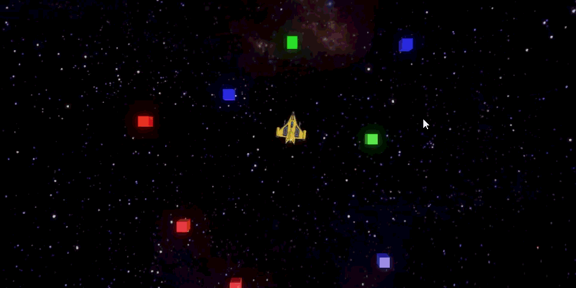
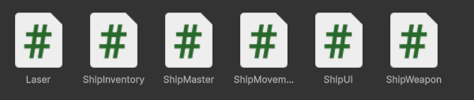
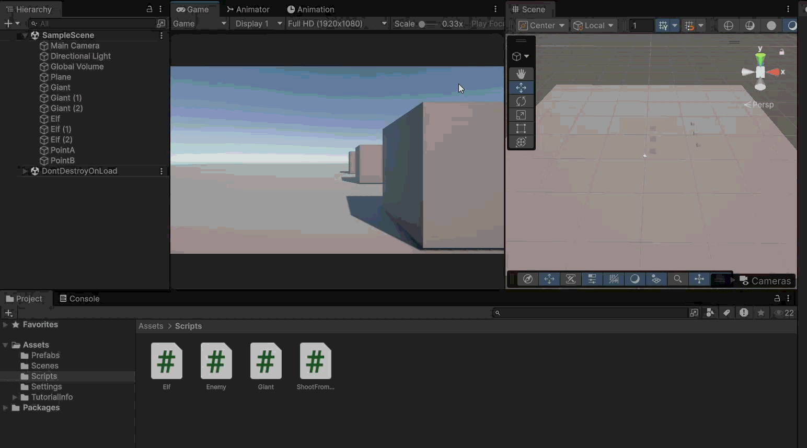

Ik heb hier een action event gebruikt om tussen scripts te comminuseren om onderandere aan de ui manager door tegeven dat hij een message moet showen wanneer de speler alle candy heeft

Ik heb elke functie een appart script gegeven

Ik heb een Enemyscript gemaakt die de enemy laat bewegen en doodgaan.
de variable van de snelheid en levens worden ingesteld via hun specifike child script (Giant en Elf)
Elf heeft ook een functie om hem 0.5 seconde onzichtbaar te maken